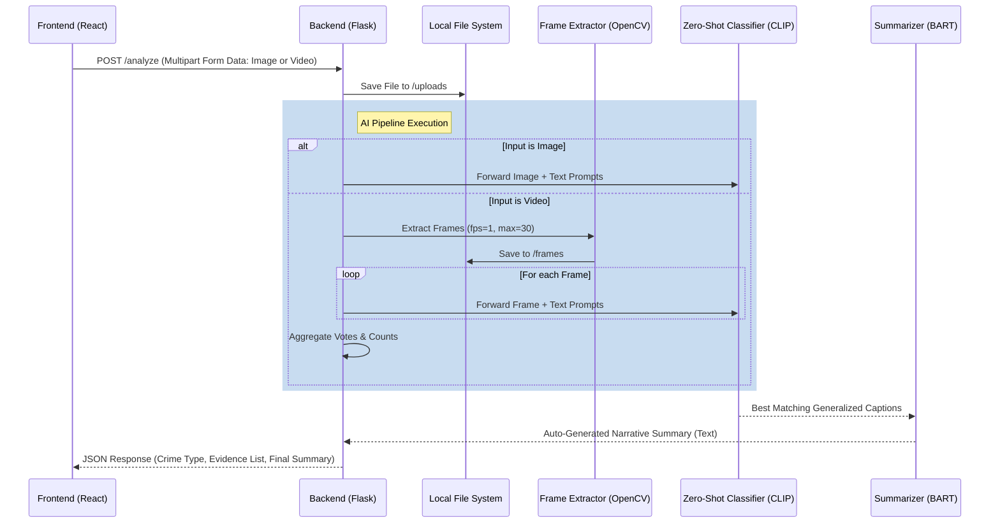

# High-Level Architecture Overview

SceneSolver is an AI-powered system designed to analyze crime scenes from video or image inputs. It leverages zero-shot classification to detect crime types, extract evidence labels, and auto-generate comprehensive summaries using a pipeline integrating state-of-the-art vision and language models.

## Core System Components

The system is organized into a modular, decoupled architecture consisting of three primary layers: Frontend (React), Backend API (Flask), and an AI Model Pipeline.

### 1. Frontend (React)
The frontend serves as the user interface, built securely and responsively with React (and React Router).

*   **Technology Stack**: React, React Router, Axios (for API communication).
*   **Role**: Handles user interactions, file selection/drag-and-drop, client-side validation of media types, and visualization of the analysis results.
*   **Key Behavior**: It restricts uploads to only `image/*` and `video/*` MIME types, provides immediate previews (video players or images), and polling/loading states while awaiting the backend's heavy processing.

### 2. Backend API (Flask)
A lightweight Python application serving as the orchestration layer between the user interface and the computational pipeline.

*   **Technology Stack**: Flask, Flask-CORS, Werkzeug.
*   **Role**: Exposes the `/analyze` POST endpoint. It manages file storage via temporary local uploads, handles exception and error states, and dispatches files to the AI pipeline.
*   **Key Behavior**: Secures the connection via CORS, validates file presence, manages basic temporary storage (`/uploads`), and handles synchronous HTTP responses returning JSON payloads to the frontend.

### 3. AI Model Pipeline
The core computational engine of SceneSolver.

*   **Technology Stack**: PyTorch, Transformers (Hugging Face), OpenCV (cv2), PIL (Python Imaging Library).
*   **Models Utilized**:
    *   **CLIP (openai/clip-vit-base-patch32)**: Configured with a `best_model.pth` (presumably fine-tuned or initialized with specific weights). Used for zero-shot classification of frames against predefined text labels (`crime_labels` and `evidence_labels`) and generalized scene matching.
    *   **BART (facebook/bart-large-cnn)**: Used to synthesize comprehensive narrative summaries derived from the top matching categorical text captions generated by CLIP.
*   **Data Strategy**: General labels and specific crime/evidence labels are stored textually to facilitate CLIP's zero-shot inference mechanism without requiring categorical model retraining.

### 4. Storage & Persistence (Transient Local Storage)
Currently, the system employs localized, transient storage.

*   **Mechanism**: The backend utilizes the local disk (`uploads/` for incoming media; `frames/` for extracted video frames).
*   **State**: The system is structurally stateless between requests. There is no persistent database configured (despite a dormant MongoDB `Models_db/db.js` file existing in the codebase).

## End-to-End Analysis Workflow

When a user submits media to the system, the data follows a precise execution path:

### Detailed Execution Steps

1.  **Input Handling**: Media is transmitted via `multipart/form-data` to `/analyze`. Flask saves the file locally.
2.  **MIME Routing**: The `pipeline.py` entrypoint (`analyze_media`) inspects the MIME type to route to either `analyze_image` or `analyze_video`.
3.  **Preprocessing (Video Only)**: OpenCV (`VideoCapture`) extracts frames. It calculates a frame interval based on the source FPS to extract exactly 1 frame per second, artificially capped at a maximum of 30 frames to bound computational cost. Frames are saved to a temporary folder (`frames/`).
4.  **Embedding & Classification (CLIP)**:
    *   The model tokenizes a static vocabulary of specific strings: `crime_labels` (e.g., "robbery") and `evidence_labels` (e.g., "Fire", "Shattered glass").
    *   For each image/frame, CLIP calculates similarity logits between the visual embedding and textual embeddings.
    *   It identifies the Top-1 `crime_label` and Top-3 `evidence_labels`. For videos, it tracks occurrences globally.
    *   It additionally selects the best matching caption from a massive dataset file (`generalized_captions_generalized.txt`).
5.  **Summarization (BART)**:
    *   The matched text captions (one for an image, up to 30 for a video) are concatenated into a single prompt string.
    *   BART condenses these independent visual descriptions into a cohesive narrative text ranging from 100 to 500 tokens.
6.  **Aggregation & Output**:
    *   For video pipelines, the *most common* crime across all frames is selected. The top 10 most frequent pieces of evidence are selected.
    *   The aggregated payload is shipped back to the UI as a JSON object.
